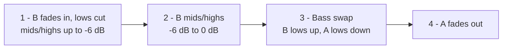
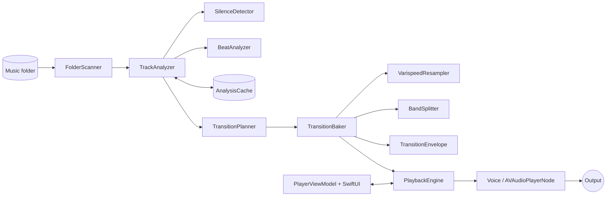

<div align="center">

# Seamless Transitions

**Turn any music folder into a continuous, beatmatched DJ mix. Native macOS app.**


</div>

<!-- Add a screenshot here, e.g.  -->

## Why

Most players either leave a gap between songs or do a plain volume crossfade. Seamless Transitions mixes like a DJ instead. The incoming track fades in with its bass cut, the basslines are swapped at the right moment, and when both tracks have a reliable beat grid the tempo ramps smoothly from one track's BPM to the other's so the beats stay locked.

## Features

- **Folder playback.** Pick a folder; it is scanned recursively for `mp3 m4a aac wav aif aiff aifc flac alac caf m4b mp4` files and played in natural path order. Hidden files, package contents and playlist files are skipped.
- **Remembers your library.** The last folder is restored via a security-scoped bookmark.
- **Beatmatched transitions.** BPM and beat-grid detection per track (60–200 BPM), with a tempo ramp across the mix.
- **EQ bass swap.** Two-band mixing (lows vs. mids/highs, split at ~150 Hz).
- **Silence trimming.** Leading and trailing silence is detected and skipped.
- **Adjustable transition length.** 30 s to 4 min in 5 s steps (default 60 s, persisted).
- **Shuffle.** Changes apply to the next transition that is not yet committed.
- **Quick skips.** Next, previous, seek and double-click-to-play use a short 1.5 s crossfade.
- **Live tempo.** The track list shows BPM; the now-playing view shows live tempo during a mix.
- **Sandboxed.** Read-only access to the folder you pick, nothing else.

## Quick start

**Requirements**

- macOS 15.0+
- Xcode 26 (Swift 6 language mode, strict concurrency)
- [XcodeGen](https://github.com/yonaskolb/XcodeGen): `brew install xcodegen`

**Build, run, test**

```sh
scripts/build.sh build   # default; regenerates the Xcode project if xcodegen is on PATH, then builds
scripts/build.sh run     # builds and opens the app
scripts/build.sh test    # runs the test suite, filtered output
```

Output goes to `build/Build/Products/Debug/SeamlessTransitions.app`. Only the Debug configuration is scripted, targeting `arch=arm64`. The build is ad-hoc signed and sandboxed (app sandbox, user-selected read-only files, app-scope bookmarks).

## Keyboard shortcuts

| Key | Action |
|---|---|
| <kbd>⌘</kbd> <kbd>O</kbd> | Open folder |
| <kbd>Space</kbd> | Play / pause |
| <kbd>⌘</kbd> <kbd>→</kbd> | Next |
| <kbd>⌘</kbd> <kbd>←</kbd> | Previous |
| <kbd>⌘</kbd> <kbd>S</kbd> | Toggle shuffle |

## How a transition works

Outgoing track **A**, incoming track **B**, transition length **T**. Audio is split into two bands at ~150 Hz: lows, and mids/highs.



| Step | Span | What happens |
|---|---|---|
| 1 | 35% of (T − swap) | B fades up with lows cut; mids/highs rise from silence to −6 dB |
| 2 | 25% of (T − swap) | B mids/highs rise from −6 dB to 0 dB |
| 3 | bass swap, up to 5 s (capped at 20% of T) | B lows up, A lows down |
| 4 | remainder | A fades out |

**Beatmatching.** When both tracks have a reliable beat grid, the master tempo follows an S-curve from A's BPM to B's BPM over the whole transition. Pitch follows tempo (vinyl-style varispeed). B's BPM is folded by half/double time before comparing. If the tempos still differ by more than 10%, or either grid is unreliable or missing, the transition is EQ-only at rate 1.0. When beatmatched, the transition length is snapped to whole bars. Length is clamped for short tracks (never below 4 s).

## Architecture



<details>
<summary><b>Analysis</b> (background, cached)</summary>

`TrackAnalyzer` (actor) runs `SilenceDetector` (first/last 30 s) and `BeatAnalyzer` (spectral-flux onset envelope, tempogram tempo estimate, dynamic-programming beat tracker, local linear-regression smoothing). Beat grids cover the first and last 270 s of the trimmed track. Downbeat is best-effort. Upcoming tracks are analyzed at high priority; the rest of the library in the background (max 2 concurrent). If analysis is not ready when a transition is committed, that transition falls back to untrimmed, no beatmatch.

</details>

<details>
<summary><b>Cache</b></summary>

`AnalysisCache` (actor) stores a JSON index plus per-track binary beat-grid sidecars. Key is path + size + mtime + algorithm version (currently 2). Location, inside the app sandbox container:

```
~/Library/Containers/com.hugopaulista.SeamlessTransitions/Data/Library/Application Support/SeamlessTransitions/
  analysis-index.json
  beats/
```

</details>

<details>
<summary><b>Baked transitions</b></summary>

Transition audio is rendered ahead of time into buffers instead of using live parameter automation:

1. A beat-warped position map aligns A's tail beats with B's head beats, with per-segment rate from the tempo ramp.
2. `VarispeedResampler`: windowed-sinc interpolation (vDSP). At rate 1 on integer frames the output is bit-identical to the source.
3. `BandSplitter`: linear-phase FIR lowpass at 150 Hz; high = input − low, so unity gains reproduce the input exactly.
4. `TransitionEnvelope` gains, a pure function of output frame, so any span can be re-baked from any offset.

The engine keeps baked chunks (2 s each) about 8 s ahead and schedules body segments and baked buffers back-to-back on per-track `AVAudioPlayerNode`s (`Voice`), so joins are sample-accurate. The next track is started at a host time derived from the player's render time. A 50 ms tick tops up scheduling, commits the next transition and detaches finished voices.

</details>

<details>
<summary><b>Concurrency</b></summary>

`PlayerViewModel` is `@MainActor @Observable` and polls an engine snapshot. `PlaybackEngine` is an actor on a custom `DispatchSerialQueue` executor; AVFoundation objects stay inside it. The analyzer and baker open their own `AVAudioFile`. Pause/seek/device-change use short ramps (10–30 ms) and rebuild from the current position.

</details>

## Project layout

| Path | Contents |
|---|---|
| `project.yml` | XcodeGen spec (generates `SeamlessTransitions.xcodeproj`) |
| `scripts/build.sh` | build / test / run wrapper |
| `SeamlessTransitions/App` | app entry, menu commands, entitlements |
| `SeamlessTransitions/Model` | `Track`, `TrimInfo`, `BeatInfo` |
| `SeamlessTransitions/Library` | folder scanning, bookmark access, metadata |
| `SeamlessTransitions/Analysis` | silence, onset, tempo, beat tracking, analyzer, cache |
| `SeamlessTransitions/Playback` | engine, voices, planner, baker, tempo ramp, resampler, band splitter, envelope, play order, GapMonitor |
| `SeamlessTransitions/UI` | SwiftUI views and `PlayerViewModel` |
| `SeamlessTransitionsTests` | Swift Testing suites and `TestAudioFactory` (synthetic click tracks, sines, silence) |

## Testing

89 tests using Swift Testing, run with `scripts/build.sh test`. Audio fixtures are synthesized in `TestAudioFactory`, so no sample files are needed.

<details>
<summary><b>Coverage</b></summary>

- Folder scan: recursion, hidden/non-audio/package skipping, extension case, natural sort
- Silence detection, play order and shuffle
- Beat/tempo analysis on synthetic tracks (90/124/128/174 BPM), no-beat rejection for noise, speech-like and sine input
- Tempo ramp: fold, 10% cap, EQ-only fallback, whole-beat durations
- Transition envelope: step boundaries, continuity, short-transition clamping
- Resampler (bit-exactness at rate 1, frequency scaling, anti-alias) and band splitter (reconstruction, chunked equals one-shot)
- Planner/baker: bar-snapped plan, bit-exact seams with raw files, no gap or jump in the mix, onset alignment through the transition, band energy per step
- Analysis cache persistence/corruption handling, analyzer priorities, engine body-limit logic

</details>

## Debugging

Debug builds include `GapMonitor`, which taps the main mixer and logs dropouts (RMS below −70 dBFS while playing) and clicks (adjacent-sample jump above 0.5):

```sh
log stream --predicate 'category == "GapMonitor"'
```

The engine logs under category `PlaybackEngine`.

## Known limitations

- Assumes constant tempo within each analyzed region; tracks with tempo drift or rubato beatmatch poorly.
- BPM has octave ambiguity (half/double); folding mitigates it but can pick the wrong octave.
- Downbeat detection is best-effort; bar alignment can be off by beats.
- Pausing or changing the output device mid-transition causes a gap of about 40 ms.
- The Debug configuration compiles with `-O` and has hardened runtime disabled (needed for the ad-hoc test bundle to load). Release keeps hardened runtime enabled.
